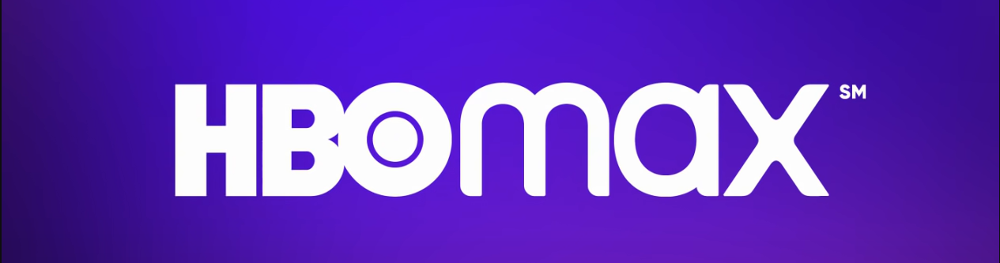

<h1 align="center">Site HBO Max</h1>
<h4 align="center">Clone com modificações</h4>

<p align="center">
  O projeto é um clone do site <a href="https://www.hbomax.com/br/pt">HBO Max</a>, com o intuito de reproduzir a interface, com algumas modificações, aplicando os temas abordados ao longo das aulas de CSS da plataforma da <a href="https://dio.me">Digital Innovation One</a>.
</p>
<p align="center">
  O clone do site HBO Max serve como desafio para os alunos da plataforma testarem seus conhecimentos e colocarem em prática os recursos de HTML e CSS abordados nos cursos.
</p>

<a href="https://guilherme-hap.github.io/hbomax-clone/">
  
</a>

## 📎 Sumário

- [✨ Features](#features)
- [📦 Temas abordados](#topics)
- [🏆 Desafio](#challenges)
- [🌈 Demonstração](#demo)
- [💻 Autora do desafio](#author)

<h2 id="features">✨ Features</h2>

- Menu de navegação
- Cabeçalho com animação gradiente
- Cards com os planos de assinatura animados
- Lista de filmes e séries disponíveis na plataforma
- Formulário de login
- Rodapé com links importantes
- UI Responsiva

*As features são visuais, não possuindo integração com nenhuma API. O intuito do projeto é reproduzir a interface do site original, com algumas modificações.*

<h2 id="topics">📦 Temas abordados</h2>

O projeto possui como intuito aplicar os conceitos abordados na Trilha de CSS da <a href="https://dio.me">DIO</a>, ministrada pela instrutora <a href="https://github.com/micheleambrosio">Michele Ambrosio</a>.

Recursos CSS presentes no projeto:

- Fundamentos do CSS
- Grid Layout
- Flexbox
- Responsividade
- Pseudo-elementos
- Pseudo-classes
- Transformações 2D e 3D
- Transições e animações
- Tratamento de campos inválidos no formulário

<h2 id="challenges">🏆 Desafio</h2>

Como parte do desafio final da Trilha de CSS, o desenvolvedor deve reproduzir [esse projeto](https://micheleambrosio.github.io/hbomax/), sem realizar uma consulta do código final do site.

As fontes utilizadas no projeto foram:

- [Raleway](https://fonts.google.com/specimen/Raleway)
- [Quicksand](https://fonts.google.com/specimen/Quicksand?query=quicksand)
  
```css
@import url("https://fonts.googleapis.com/css2?family=Raleway:wght@300;400;500;600;700&display=swap");
@import url("https://fonts.googleapis.com/css2?family=Quicksand:wght@300;400;700&display=swap");
```

<h2 id="demo">🌈 Demonstração</h2>

Você pode acessar ao resultado final do projeto [clicando aqui](https://guilherme-hap.github.io/hbomax-clone/).


<h2 id="author">💻 Autora do desafio</h2>
<p>
    
    <p>&nbsp&nbsp&nbspMichele Queiroz Ambrosio<br>
    &nbsp&nbsp&nbsp<a href="http://instagram.com/programi_">Instagram</a>&nbsp;|&nbsp;<a href="https://github.com/micheleambrosio">GitHub</a>&nbsp;|&nbsp;<a href="https://www.linkedin.com/in/michele-ambrosio-a4899661/">LinkedIn</a>&nbsp;|&nbsp;<a href="https://www.twitch.tv/michele_ambrosio">Twitch</a></p>
</p>
<br/><br/>
<p>

---
⌨️ com ❤️ por [Michele Ambrosio](https://github.com/micheleambrosio) 😊
